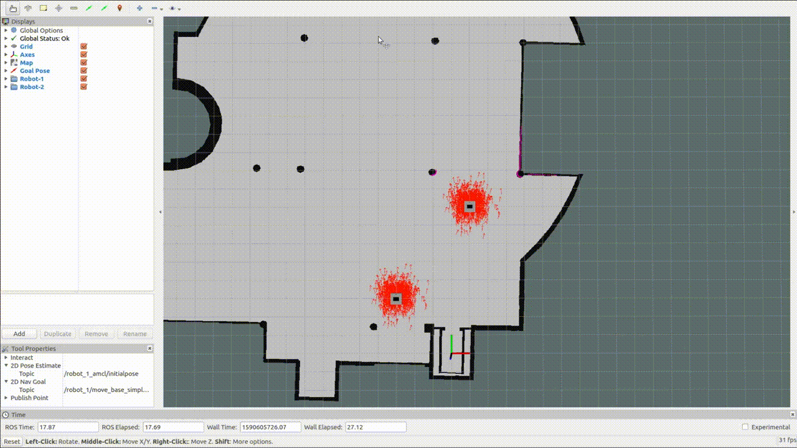

A ROS package to simulate a fleet of robots.



# Table of Contents
   * [Installation](#installation)
      * [Dependencies](#dependencies)
      * [Install instructions](#install-instructions)
   * [Usage](#usage)
      * [Single robot simulation](#single-robot-simulation)
      * [Multi robot simulation](#multi-robot-simulation)
         * [Generating the configuration files](#generating-the-configuration-files)
         * [Launching the multi-robot simulations](#launching-the-multi-robot-simulations)

# Installation

## Dependencies
1. [ROPOD sim model](https://github.com/DharminB/ropod_sim#ropod_sim)
2. [TEB local planner](http://wiki.ros.org/teb_local_planner)

## Install instructions
1. Install dependencies
    ```
    sudo apt install -y ros-kinetic-teb-local-planner
    ```
2. Setup the catkin Workspace
    ```
    mkdir -p ~/catkin_ws/src/simulation
    cd ~/catkin_ws
    wstool init src/simulation
    wstool merge -t src/simulation https://raw.githubusercontent.com/Sushant-Chavan/multi_robot_sim/kinetic/multi-robot-sim.rosinstall
    wstool update -t src/simulation
    # rosdep install --from-paths src/simulation --ignore-src --rosdistro=kinetic -y
    ```
3. Build and source the packages
    ```
    catkin build
    source ~/catkin_ws/devel/setup.bash
    ```

# Usage

## Single robot simulation

1. Start the default simulation configuration using the below command
    ```
    roslaunch ropod_single_robot_sim single_robot_sim.launch
    ```
2. To spawn the robot at a different pose, you can use the `init_x`, `init_y` and `init_theta` (in radians) arguments as follows:
    ```
    roslaunch ropod_single_robot_sim single_robot_sim.launch init_x:=1.0 init_y:=10.0 init_theta:=1.571
    ```
3. Several other arguments are available and can be looked up in the [launch file](ropod_single_robot_sim/ros/launch/single_robot_sim.launch).


## Multi robot simulation

### Generating the configuration files

1. Assuming you wish to generate configuration files for the `brsu` map. You can use the below command to generate all the necessary config files need for multi-robot simulations. This command sets up the simulations with 2 robots.
    ```
    roscd multi_robot_sim
    python3 ros/scripts/generate_multi_robot_launch.py brsu
    ```
2. The `--nRobots` parameter can be used to generate configuration files for `N` robots. For example to generate config files for 3 robots, use the command
    ```
    python3 ros/scripts/generate_multi_robot_launch.py brsu --nRobots 3
    ```
3. You can setup custom spawn poses for the robots as yaml config files. For example [brsu_init_poses.yaml](multi_robot_sim/ros/config/spawn_pose_config/brsu_init_poses.yaml). You can use these poses to spawn the robots using the `--custom_poses` parameter as shown below
    ```
    python3 ros/scripts/generate_multi_robot_launch.py brsu --custom_poses
    ```

### Launching the multi-robot simulations

1. After generating the necessary config file, launch the simulation using the below command
    ```
    roslaunch multi_robot_sim multi_robot.launch
    ```
2. If you wish to not launch Gazebo client, use the below command
    ```
    roslaunch multi_robot_sim multi_robot.launch gui:=false
    ```
